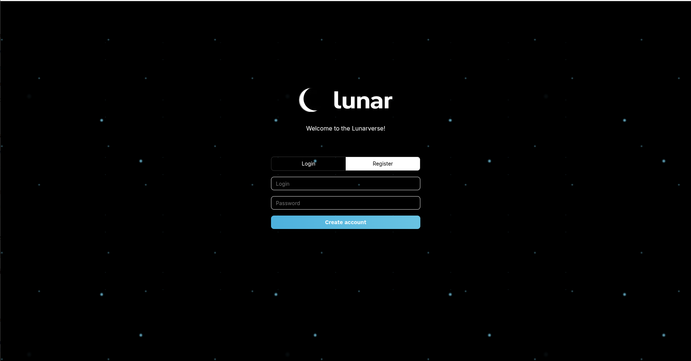
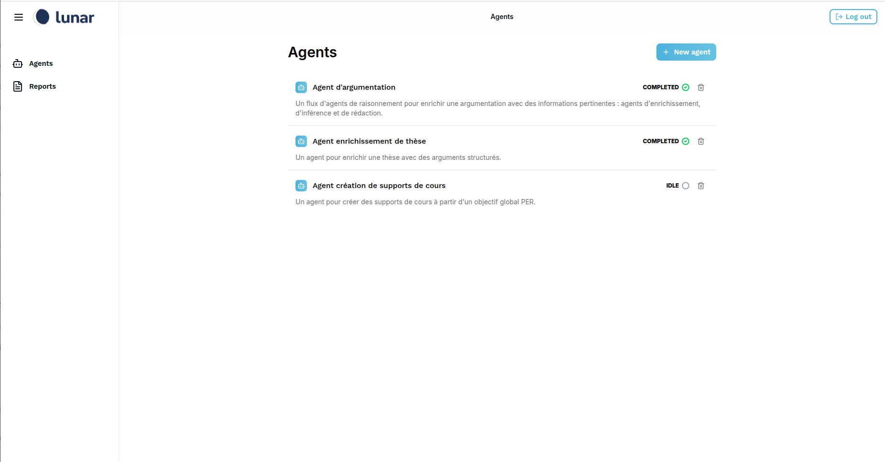
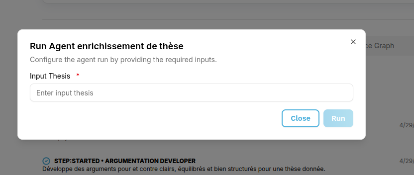
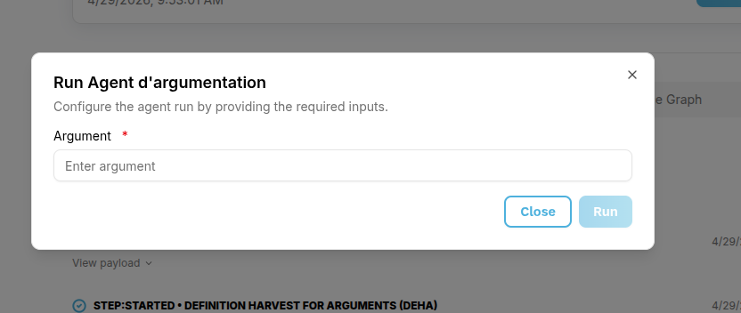
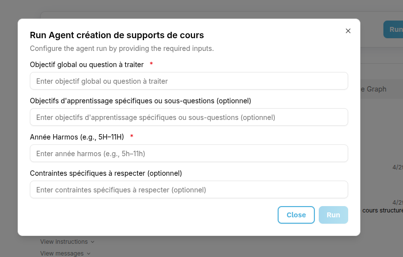
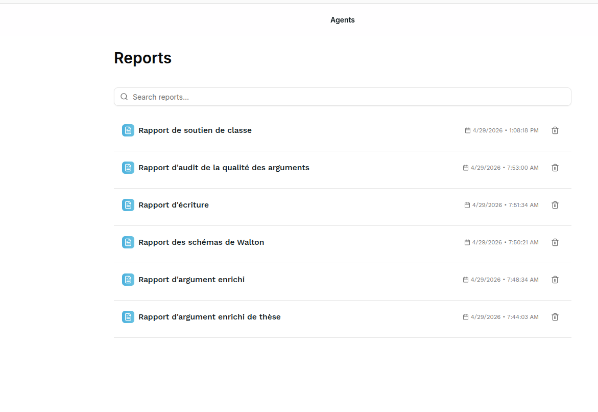

<!--
# SPDX-FileCopyrightText: Copyright © 2025 Idiap Research Institute <contact@idiap.ch>
# SPDX-FileContributor: Imen Ben Mahmoud <imen.benmahmoud@idiap.ch>
#
# SPDX-License-Identifier: GPL-3.0-only
-->
# Lunar agents studio

This repository contains the open-source framework developed during the AI-literacy project used for developing, managing, and observing AI agents workflows powered by the Lunar platform.

## Prerequisites

This project uses **[uv](https://github.com/astral-sh/uv)** for dependency management and reproducible Python environments.

**Required:**

- Python (version specified in `pyproject.toml`)
- [uv](https://github.com/astral-sh/uv) - Python package and environment manager
- Docker (for containerized deployment)

## Installation

Once `uv` is installed, run from the project root (where `pyproject.toml` and `uv.lock` are located):

```bash
uv sync
```

This will:

- Create a virtual environment if needed
- Install exact dependency versions pinned in `uv.lock`

## Configuration

### API Keys

This project requires an **OpenAI API key**.

1. Copy the example environment file:

```bash
cp .env_example .env
```

1. Open `.env` and set your API key:

```bash
OPENAI_API_KEY=your_api_key_here
```

## Prompt Architecture

The project is organized around modular prompt pipelines, defined as YAML files. Each prompt corresponds to a specific reasoning or analysis task.


### Enrichment Prompts

These prompts extract structured information from an argument:

- **Assumption Harvester** : Identifies implicit assumptions supporting the argument.

- **Constitutional Alignment Harvester** : Evaluates alignment with Switzerland (CH), United States (US) and European Union / ECHR

- **Definition Harvester** : Extracts key concepts that require clarification.

- **Ethical Stance Harvester** : Identifies ethical frameworks and positions.

### Inference Prompts

- **Walton Scheme Harvester** : Classifies arguments according to Walton’s argumentation schemes.

### Writing & Evaluation Prompts

These prompts analyze and refine arguments:
  
- **Logical Analysis (Detailed / Rhetorical)** : Breaks down logical structure and rhetorical strategies.
- **Emotional & Political Analysis** : Adopts a political stance and uses emotional appeal to the argumentation.
- **Integrated Argument Synthesizer** : Produces a refined or enriched version of the argument.
- **Argument Quality Auditor** : Evaluates overall strength and weaknesses.

### Visualization

- **Visualization Pipeline**  
  Structures outputs for rendering in the web interface (`visualization/`). The output of this stage is a json file.

The pipelines can be extended by adding new YAML prompt files and modifying the steps in `reasoner_agent.yaml`.

## Running the Pipeline

### Standard Pipeline

The project includes 3 example arguments in `arguments.yaml`:

1. Select which argument to analyze by editing `main.py`
2. Run the pipeline:

```bash
uv run main.py
```

1. Outputs are saved in `outputs/argument_id/`

#### Visualization

After running the pipeline, visualize arguments as an interactive graph (with pro and con sides):

```bash
uv run python prompts/visualization/server.py --graph_path /path/to/visualization/output
```

### Lunarflow Workflow

Alternatively, we can use [Lunarflow](https://github.com/lunarbase-ai/lunarflow) - a declarative framework for building modular workflows and agents:

1. Lunarflow prompts use a different template and end with `_lunar.yaml`
2. Run the workflow:

```bash
uv run lunarflow_reasoner.py
```

1. Outputs are saved in `outputs/argument_id/`

**Note:** Visualization is not available with the Lunarflow method.

You can extend both pipelines by adding new YAML prompt files and registering them in their respective configuration files.

### Lunar interface Deployment

The Lunar platform is a web-based interface for visualizing and executing Lunarflow workflows with built-in provenance tracing for tracking execution paths and data lineage, plus an integrated trust evaluation system to assess the reliability and transparency of worlflow outputs.

#### Configuration

```bash
cp .env .env.docker
```

```bash
cd lunar-chat-interface
cp .env.docker.example .env.docker
```

Set the missing value.

#### Running with Docker

**First time (builds images):**

```bash
docker compose up --build
```

**Subsequent runs:**

```bash
docker compose up
```

The platform will be available at **<http://localhost:3000>**

#### Using the Platform

1. **Login page** - Register with your credentials on first access



2. **Dashboard** - After logging in, you will see the main interface



beside the argumentation workflow, we added the "Agent création de supports de cours" and "Agent enrichissement de thèse" that were later used for the workshop.

3. **The input**

| | | |
|---|---|---|
|  |  |  |

**Agent création de supports de cours** : The input can be taken from the PER ( Plan d'études romand ) from any subject.

**Agent d'argumentation** : The input is the same as before, taken from `arguments.yaml` or created by you.

**Agent enrichissement de thèse** : The input is a thesis for argumentation, for example " L'éducation devrait être gratuite pour tous.tes"


4. **The output** : The outputs are seen in the Reports window.



## Contact

For questions, feel free to reach out at <ibmahmoud@idiap.ch>.